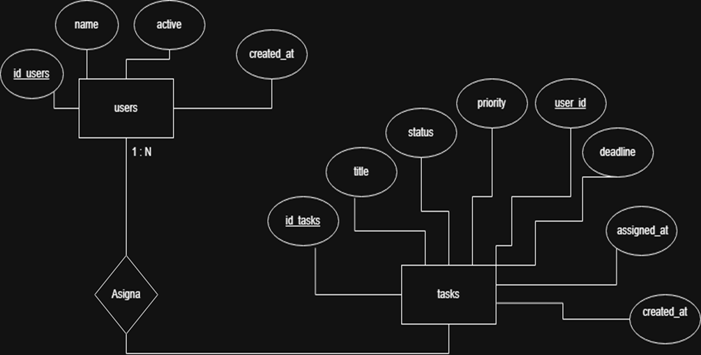

# 📝 Task Manager  

Aplicación web para la **gestión de tareas**, desarrollada con PHP, MariaDB y Bootstrap.  
Permite crear, editar, eliminar y listar tareas, asignar responsables activos y validar información.  
Incluye modales, interfaz moderna y estructura organizada por carpetas.

<h2>📌 Requerimientos Funcionales</h2>

<table style="width:100%; border-collapse: collapse;">
  <tr style="background-color:#ccf5cc; font-weight:bold; text-align:left;">
    <th style="padding:8px; border:1px solid #999;">Código</th>
    <th style="padding:8px; border:1px solid #999;">Descripción</th>
  </tr>

  <tr>
    <td style="padding:8px; border:1px solid #999;">RF1</td>
    <td style="padding:8px; border:1px solid #999;">El sistema debe permitir crear, listar, editar y eliminar tareas.</td>
  </tr>

  <tr>
    <td style="padding:8px; border:1px solid #999;">RF2</td>
    <td style="padding:8px; border:1px solid #999;">El sistema debe permitir asignar un responsable activo al crear o editar una tarea.</td>
  </tr>

  <tr>
    <td style="padding:8px; border:1px solid #999;">RF3</td>
    <td style="padding:8px; border:1px solid #999;">Cuando se cambie el responsable de una tarea, el sistema debe actualizar la fecha <code>assigned_at</code>.</td>
  </tr>

  <tr>
    <td style="padding:8px; border:1px solid #999;">RF4</td>
    <td style="padding:8px; border:1px solid #999;">El sistema debe mostrar únicamente los usuarios activos en el campo <code>&lt;select&gt;</code> dentro de los formularios.</td>
  </tr>

  <tr>
    <td style="padding:8px; border:1px solid #999;">RF5</td>
    <td style="padding:8px; border:1px solid #999;">El título de la tarea debe ser obligatorio.</td>
  </tr>

  <tr>
    <td style="padding:8px; border:1px solid #999;">RF6</td>
    <td style="padding:8px; border:1px solid #999;">Solo se pueden asignar responsables que estén en estado activo.</td>
  </tr>

  <tr>
    <td style="padding:8px; border:1px solid #999;">RF7</td>
    <td style="padding:8px; border:1px solid #999;">El sistema debe mostrar en una tabla: nombre del responsable, estado de la tarea, prioridad y fecha límite.</td>
  </tr>

  <tr>
    <td style="padding:8px; border:1px solid #999;">RF8</td>
    <td style="padding:8px; border:1px solid #999;">El sistema debe mostrar el tiempo que ha pasado desde la creación de la tarea hasta la fecha actual.</td>
  </tr>
</table>

🧩 Modelo Entidad–Relación

El modelo describe la interacción entre users activos y tasks dentro del sistema:

Un usuario activo puede ser responsable de múltiples tareas.

Cada tarea tiene solo un responsable asignado.

 <strong>📘 Diagrama ER - Users y Tasks</strong>   

🎨 Diseño Visual (Mockups)

A continuación se muestran los mockups del sistema Task Manager, organizados por pantallas clave de la aplicación.

🏠 1. Pantalla Principal — Lista de Tasks

  

➕ 2. Pantalla Crear Tasks

  

✏️ 3. Pantalla Editar Tasks

  

❌ 4. Pantalla Confirmación de Exíto

  

⚠️ 5. Pantalla de Error o Alerta

  

📌 Puedes ver y navegar los mockups completos en el siguiente enlace:
🔗 https://balsamiq.cloud/shs3f4b/py1dnmi

🗄️ Diseño de Base de Datos (MariaDB)

<table> <tr style="background-color:#d4f8d4; font-weight:bold;"> <td>Tabla</td> <td>Campo</td> <td>Tipo</td> <td>Descripción</td> </tr> <!-- USERS --> <tr> <td rowspan="4"><b>users</b></td> <td>id_users</td> <td>INT (PK)</td> <td>Identificador único del usuario.</td> </tr> <tr> <td>name</td> <td>VARCHAR(100)</td> <td>Nombre completo del usuario.</td> </tr> <tr> <td>active</td> <td>TINYINT(1)</td> <td>Estado del usuario (1 = activo, 0 = inactivo).</td> </tr> <tr> <td>created_at</td> <td>TIMESTAMP</td> <td>Fecha de creación del registro.</td> </tr> <!-- TASKS --> <tr> <td rowspan="7"><b>tasks</b></td> <td>id_tasks</td> <td>INT (PK)</td> <td>Identificador único de la tarea.</td> </tr> <tr> <td>title</td> <td>VARCHAR(255)</td> <td>Título de la tarea.</td> </tr> <tr> <td>user_id</td> <td>INT (FK → users.id_users)</td> <td>Responsable de la tarea (solo usuarios activos).</td> </tr> <tr> <td>status</td> <td>ENUM('Pendiente','En progreso','Completada')</td> <td>Estado actual de la tarea.</td> </tr> <tr> <td>priority</td> <td>ENUM('Baja','Media','Alta')</td> <td>Nivel de prioridad asignada.</td> </tr> <tr> <td>deadline</td> <td>DATE</td> <td>Fecha límite de entrega.</td> </tr> <tr> <td>assigned_at</td> <td>TIMESTAMP</td> <td>Fecha/hora de asignación del responsable (actualiza si cambia).</td> </tr> <tr> <td>created_at</td> <td>TIMESTAMP</td> <td>Fecha de creación de la tarea.</td> </tr> </table>
🧠 Trigger del Sistema

Cuando el responsable de una tarea cambia, la base de datos actualiza automáticamente la fecha de asignación (assigned_at).

<table style="background-color:#e8fbe8; border-radius:8px; padding:10px; width:100%;"> <tr> <th align="left">Acción</th> <th align="left">Resultado automático</th> </tr> <tr> <td>Cambiar el responsable (user_id)</td> <td>✔ Se actualiza <b>assigned_at</b> con la fecha y hora actuales</td> </tr> <tr> <td>No cambiar el responsable</td> <td>— El valor de <b>assigned_at</b> permanece igual</td> </tr> </table>
  