# ⭐ Gestor de Tareas – Proyecto Semillero


---

## 📚 Contenido

* [Descripción General](#descripción-general)
* [Tecnologías](#tecnologías)
* [Estructura del Proyecto](#estructura-del-proyecto)
* [Base de Datos (MariaDB)](#base-de-datos-mariadb)
* [Instalación](#instalación)
* [Requerimientos Funcionales](#requerimientos-funcionales)
* [Validaciones del Sistema](#validaciones-del-sistema)
* [Capturas de Funcionamiento](#capturas-de-funcionamiento)
* [Control de Versiones (Git)](#control-de-versiones-git)

---

## Descripción General

El **Gestor de Tareas** es una aplicación CRUD desarrollada en **PHP nativo**, utilizando **MariaDB**, **HTML/CSS**, **Bootstrap** y **jQuery**.

Permite:

* Crear, editar, listar y eliminar tareas.
* Asignar responsables **activos** y registrar automáticamente la fecha de asignación.
* Validar datos en el cliente y en el servidor.
* Mostrar prioridad, estado, fecha límite y tiempo transcurrido.

---

## 📱 Mockup

Maqueta o representación visual de un aplicación web que muestra cómo se verá en su forma final, antes de ser fabricado :

### Pantalla principal

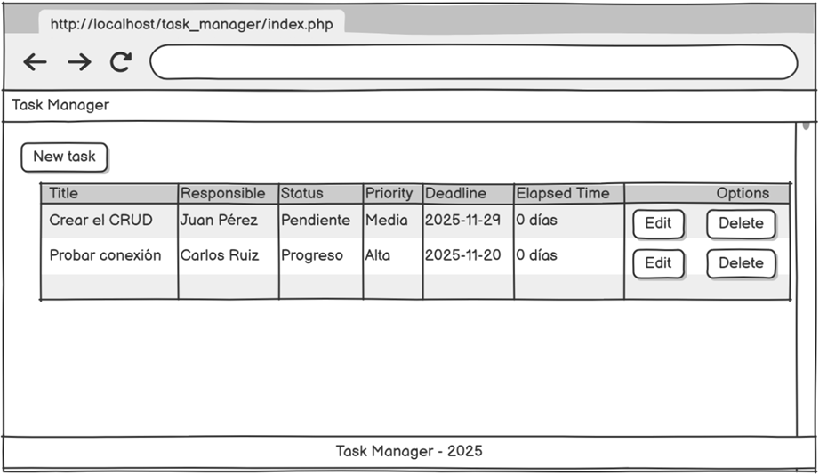

### Crear tarea

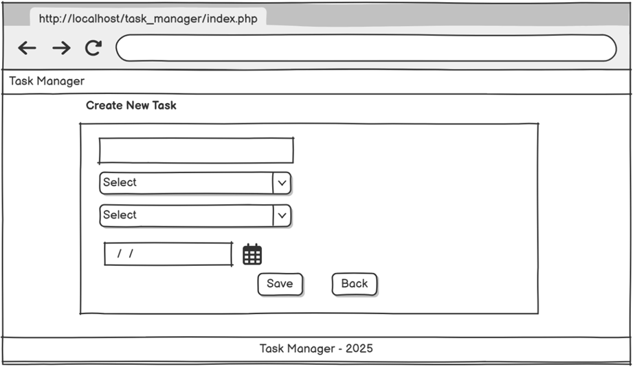

### Editar tarea

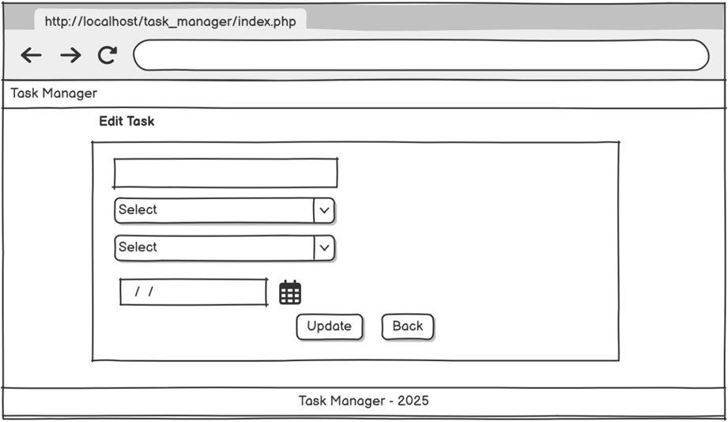

### Ventana modal de éxito

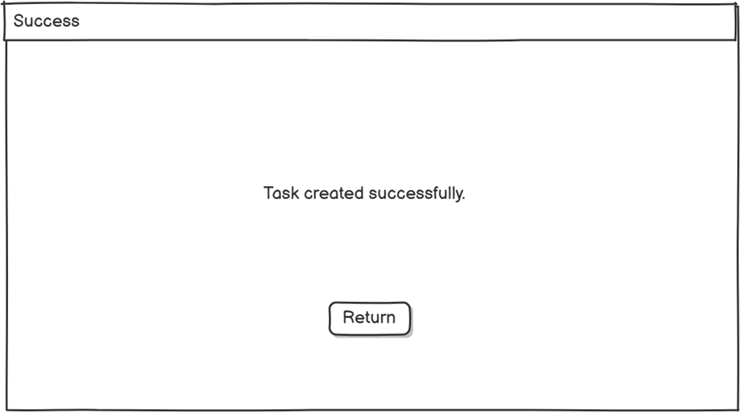

### Ventana modal de error


---

## Tecnologías

| Tecnología | Uso |
|-----------|-----|
| **PHP 8** | Lógica del servidor |
| **MariaDB** | Base de datos |
| **Bootstrap 5** | Interfaz |
| **CSS** | Estilos personalizados |

---

## Estructura del Proyecto 

```txt
task_manager/
│
├── index.php
│
├── public/                      # Vistas
│   ├── create.php               # Crear tarea
│   ├── edit.php                 # Editar tarea
│   └── delete.php               # Eliminar tarea
│
├── src/
│   └── controllers/             # Lógica del sistema
│       ├── save_actions.php
│       ├── edit_action.php
│       └── delete_action.php
│
├── includes/
│   ├── header.php
│   └── footer.php
│
├── assets/
│   ├── js                      # Validaciones 
│   └── img                     # Capturas del sistema
|
│
├── db/
│   ├── config.php
│   └── database.sql
│
└── README.md
```

---

## Base de Datos (MariaDB)

```
CREATE TABLE users (
    id_user INT PRIMARY KEY AUTO_INCREMENT,
    name VARCHAR(100) NOT NULL,
    is_active TINYINT(1) DEFAULT 1
);

CREATE TABLE tasks (
    id_tasks INT PRIMARY KEY AUTO_INCREMENT,
    title VARCHAR(255) NOT NULL,
    description TEXT,
    priority ENUM('low','medium','high') NOT NULL,
    deadline DATE NOT NULL,
    user_id INT,
    assigned_at TIMESTAMP DEFAULT CURRENT_TIMESTAMP,
    FOREIGN KEY (user_id) REFERENCES users(id_user)
);

---

```

---

🧠 Trigger del Sistema

```
CREATE TRIGGER trg_update_assigned_at
BEFORE UPDATE ON tasks
FOR EACH ROW 
BEGIN
    IF NEW.user_id != OLD.user_id THEN
        SET NEW.assigned_at = CURRENT_TIMESTAMP;
    END IF;
END;

```

---

## Instalación

1. Clonar el repositorio:

```bash
git clone https://github.com/YuliPaez/task_manager
cd task_manager
```

---

2. Importar la base de datos:

```bash
mysql -u root -p
CREATE DATABASE task_manager;
USE task_manager;
SOURCE db.sql;
```

---

3. Configurar la conexión en `db/config.php`.

```bash
<?php
//Parametros de conexión a la base de datos maria db
$host = "127.0.0.1"; 
$port = 3307;
$user = "root";
$pass = "12345";
$dbname = "task_manager";

$conn = new mysqli($host, $user, $pass, $dbname, $port);

// Verificar conexión
if ($conn->connect_error) {
    die("❌ Error de conexión: " . $conn->connect_error);
}

$conn->set_charset("utf8");
?>


```

---

## Requerimientos Funcionales

* CRUD completo de tareas.
* Solo usuarios **activos** pueden ser responsables.
* Fecha `assigned_at` se actualiza al cambiar de responsable.
* Validaciones en cliente y servidor.
* Listado con responsable, prioridad, estado y fecha límite.
* Cálculo del tiempo transcurrido desde la creación.

---

## Validaciones del Sistema

### 🟦 **Validaciones del Cliente (jQuery)**

* Título obligatorio.
* Responsable obligatorio y activo.
* Fecha límite mayor o igual a hoy.

Cuando el usuario hace clic en Enviar en el formulario, el atributo:

 `onsubmit="return validarFormulario()"`


---

 hace que el navegador ejecute la función validarFormulario() antes de enviar los datos al servidor.
 
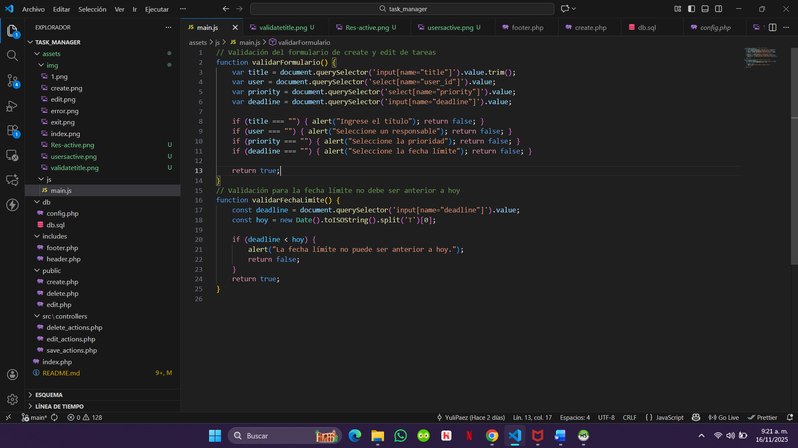

---

* `title` no vacío.
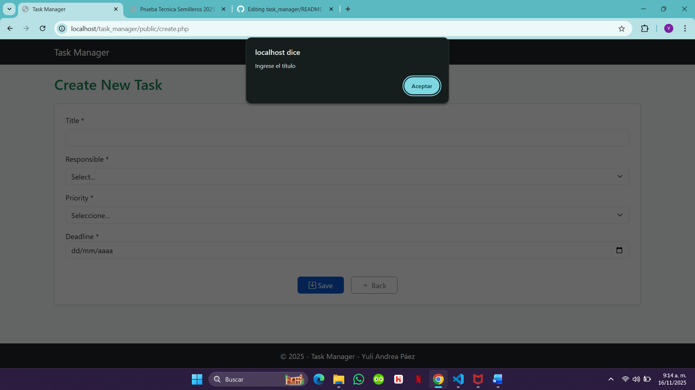

---

* `Responsable` debe estar activo.

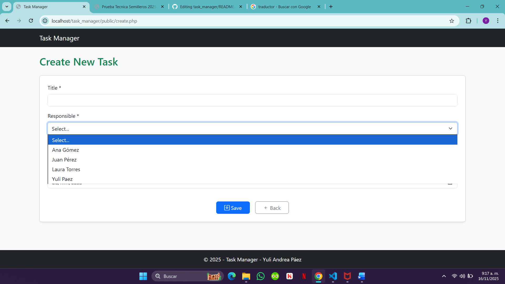

---

* `MariaDB` verificar los responsables activos


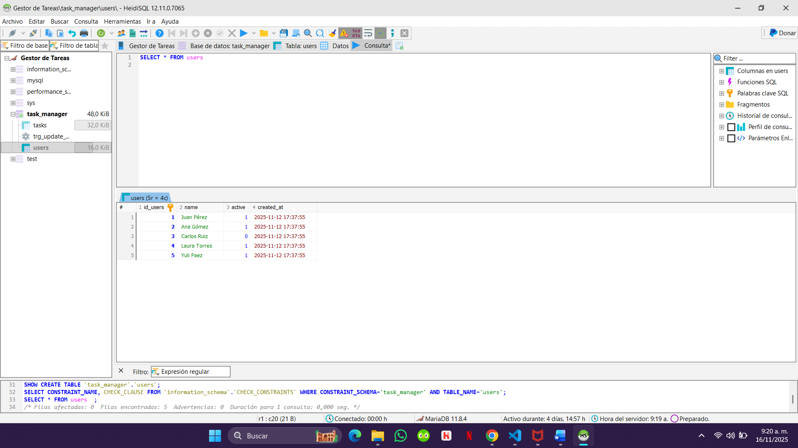


---

### **Validaciones del Servidor (PHP)**

```php
try {
    if (empty($title) || empty($user_id) || empty($priority) || empty($deadline))
        throw new Exception("Todos los campos son obligatorios.");

    if (!in_array($priority, $valid_priorities))
        throw new Exception("Prioridad inválida.");

    if (!$taskObj->isUserActive($user_id))
        throw new Exception("El usuario seleccionado no está activo.");

    if (strtotime($deadline) < strtotime(date('Y-m-d')))
        throw new Exception("La fecha límite no puede ser anterior a hoy.");

} catch (Exception $e) {
    echo "Error: " . $e->getMessage();
}
```

---

## Capturas de Funcionamiento

### 🟦 Crear Tarea

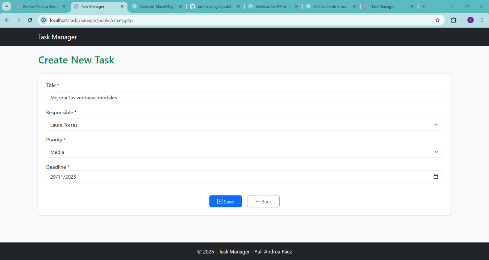

## Guardamos la nueva tarea 

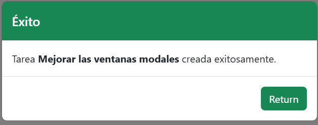

### 🟧 Editar Tarea

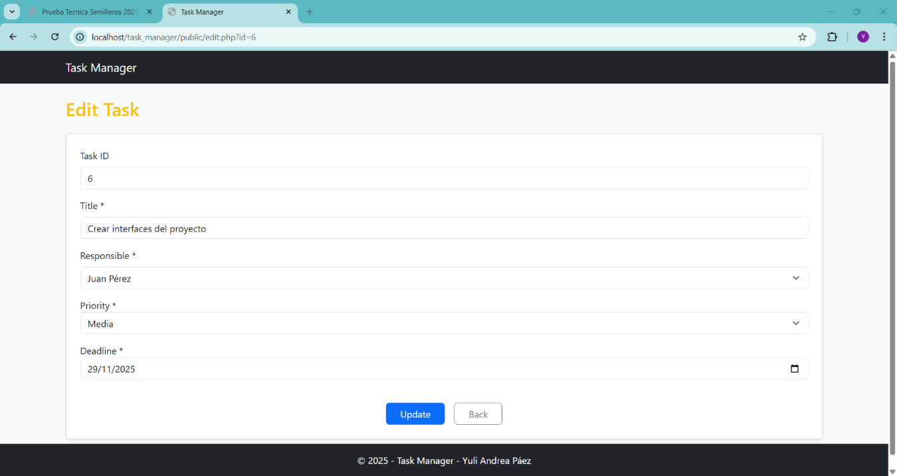

## Vamos a HeidiSQL de MariaDB y ejecutamos una consulta para verificar si nuestra tarea quedó registrada

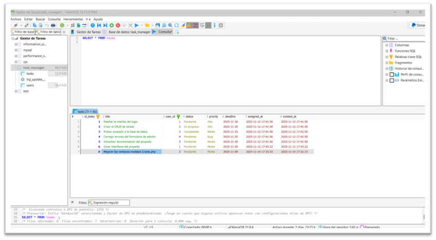

## Al cambiar de responsable, actualizar la fecha assigned_at tenemos en cuenta que a continuación muestra el id 2 que corresponde a Ana Gómez 

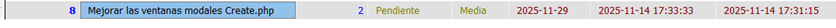

## Cambiemos de responsable a ver si actualiza la fecha 


---

## Podemos verificar que si actualiza la fecha cada vez que cambia de responsable 

## Actualizamos tarea

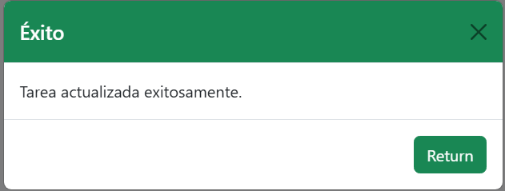

---

### 🟥 Eliminar Tarea

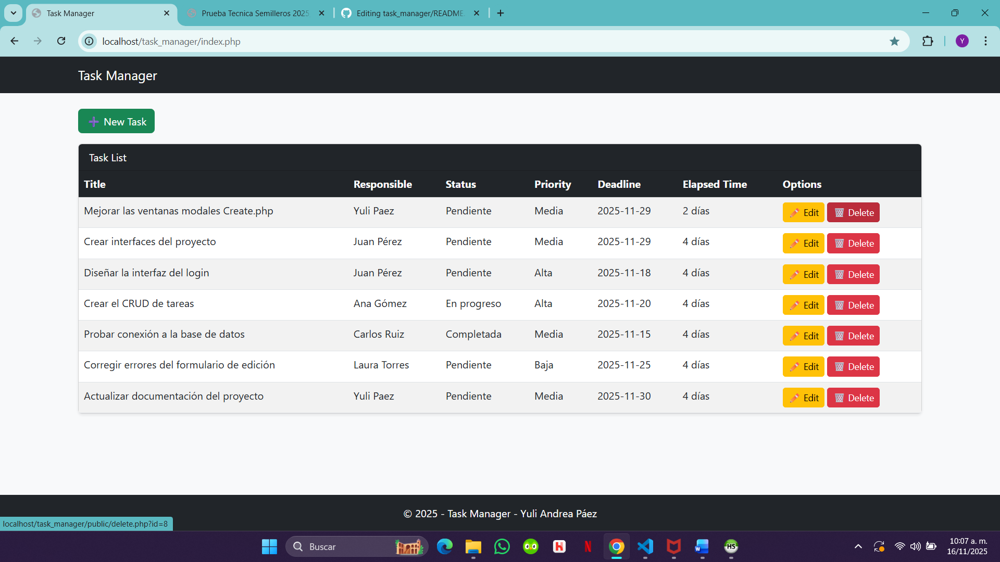

---

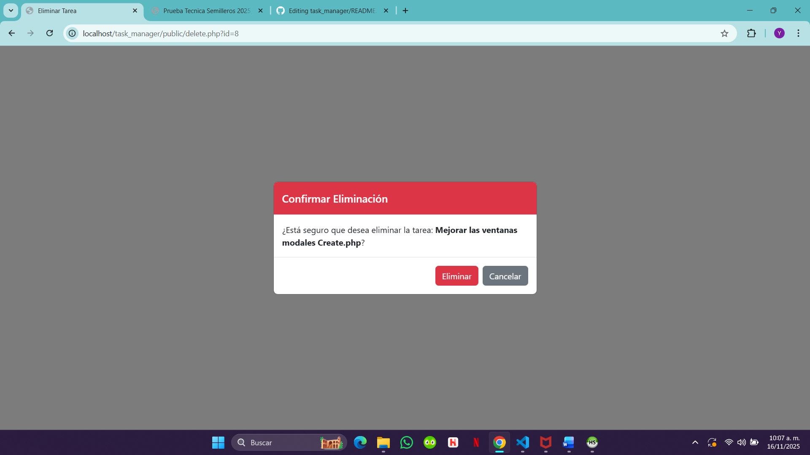

---

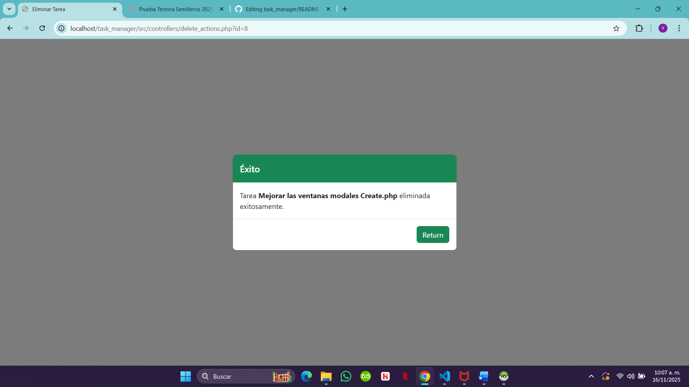

---

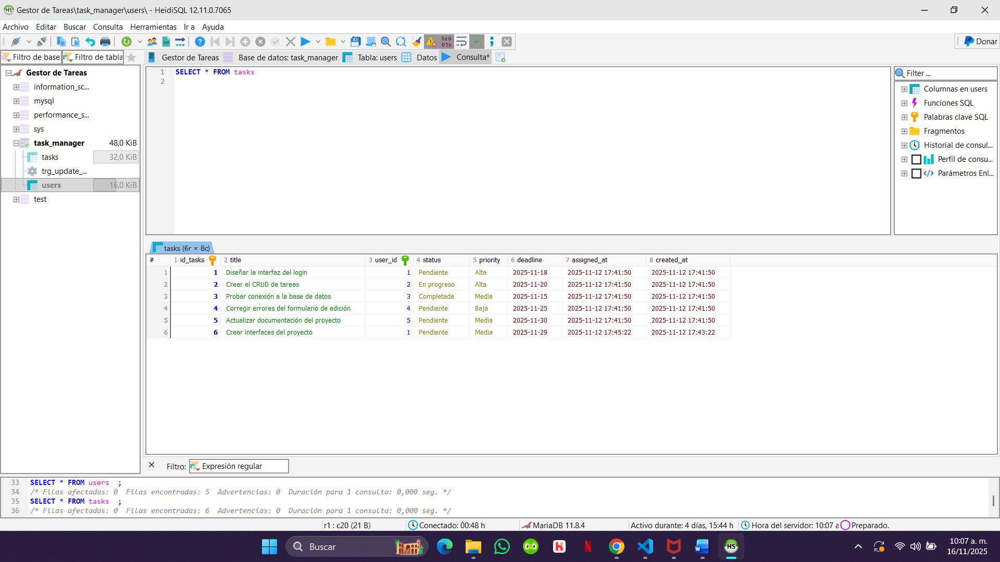

---

### 🟩 Listado de Tareas

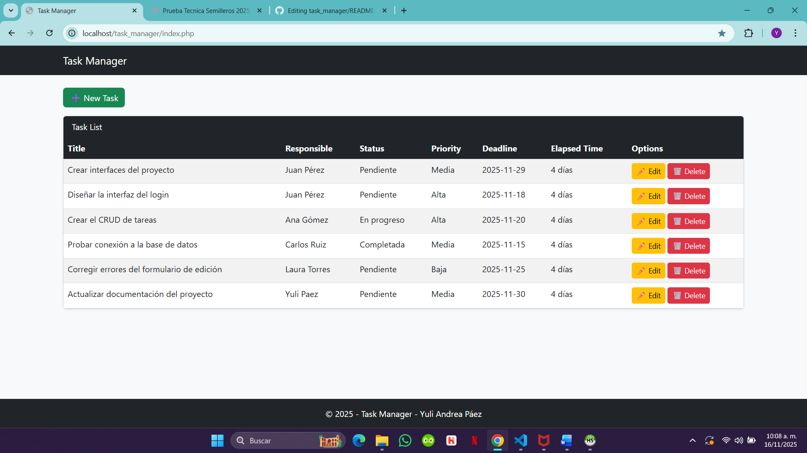

---

## Control de Versiones (Git)

1. **Commit 1 – Estructura inicial del proyecto**

   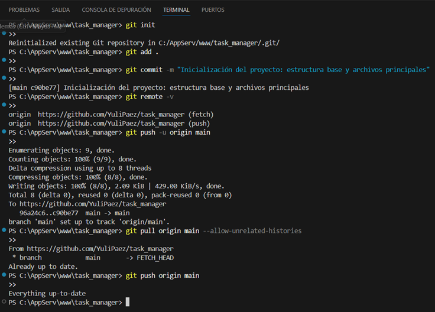

---

2. **Commit 2 – Base de datos (tablas y relaciones)**

   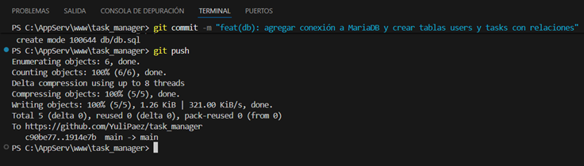

---

3. **Commit 3 – Controllers (CRUD + validaciones iniciales)**
   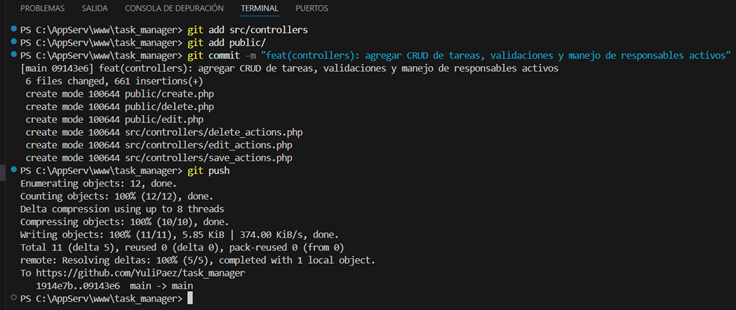

---

4. **Commit 4 Validaciones del lado del cliente, fecha límite y corrección de formularios**
   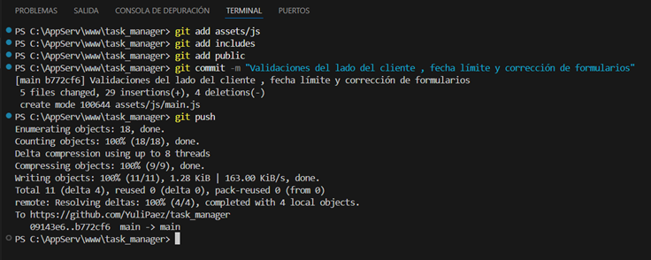

---

5. **Commit 5 Mejoras UI + modales Bootstrap**
   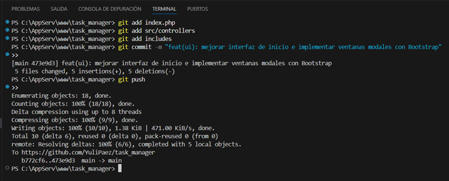

---

## 📌 Conclusiones

Este proyecto permitió poner en práctica:

* Programación en PHP nativo.
* Diseño y relaciones en MariaDB.
* Validaciones cliente/servidor.
* Uso de triggers.
* Control de versiones profesional con Git.

---

## 🌐 Sitio Web en Línea

La aplicación web también está disponible en línea en el siguiente enlace:

[Acceder al Gestor de Tareas](https://gestordetareas.infinityfree.me)

